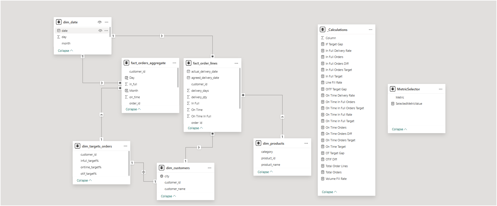
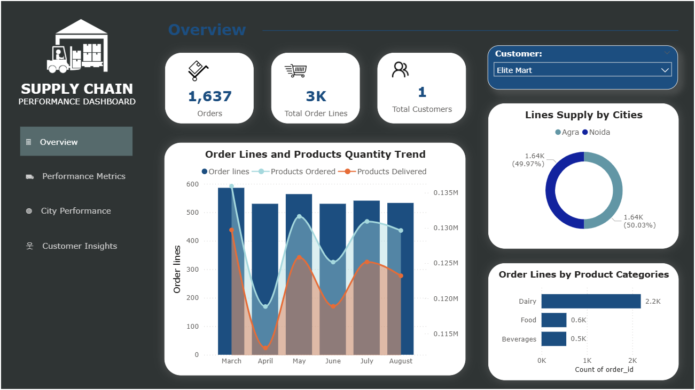

# FMCG Supply Chain Performance Analysis
FMCG Supply Chain Performance Data Analysis Dashboard
This is an end-to-end project on Supply Chain in the Fast-Moving Consumer Goods (FMCG) domain. It solves a real business problem and provides useful insights on an interactive dashboard to stakeholders using Power BI.

**Problem Statement**
Capital Mart is a growing FMCG manufacturer headquartered in Uttar Pradesh, India. It is currently operational in three cities: Lucknow, Noida, and Agra. They want to expand to other metros/Tier 1 cities in the next 2 years.

Capital Mart is currently facing a problem where a few key customers did not extend their annual contracts due to service issues. It is speculated that some of the essential products were either not delivered on time or not delivered in full over a continued period, which could have resulted in bad customer service. Management wants to fix this issue before expanding to other cities and has requested their supply chain analytics team to track the ‘On time’ and ‘In Full’ delivery service level for all customers on a daily basis so that they can respond swiftly to these issues.

The Supply Chain team decided to use a standard approach to measure the service level, in which they will measure ‘On-time delivery (OT) %’, ‘In-full delivery (IF) %’, and On-Time In-Full (OTIF) %’ of the customer orders daily against the target service level set for each customer.

**Task**
Abhinay Pandey is the data analyst on the supply chain team who recently joined Capital Mart. He has been briefed about the task in the stakeholder business review meeting. Imagine yourself as Peter Pandey and play the role of the new data analyst who is excited to build this dashboard and perform the following tasks:

Create the metrics according to the metrics list.

Create a dashboard according to the requirements provided by stakeholders in the business review meeting. You will be provided with the transcript of this business review meeting in a comic form.

Create relevant insights not provided in the metric list or stakeholder meeting.

**Data Model**

**Dashboard**

***Key Insights**:
Dairy products are in the majority.

Products are not being delivered in the full ordered quantity.

All the performance metrics (OT%, IF%, OTIF%) are below the target, indicating that the mart's supply chain is not performing well.

Line Fill Rate is 65.96%, which means many of the orders are not being delivered in full quantity.

Volume Fill Rate is around 96%, which means there is a 4% difference in the quantity of items when they reached the customers.

There have been no noticeable improvements in any of the key metrics in the last few months.

There is a big gap in IF% vs. Target for most of the customers. Is this because of less production?

Lotus Mart, Coolblue, and Acclaimed Stores are among the customers with the highest number of orders but also the most delayed delivery rate.

# Dash Board is available as Supply-chain-dashboard.pbix and can be downloaded and can be seen

